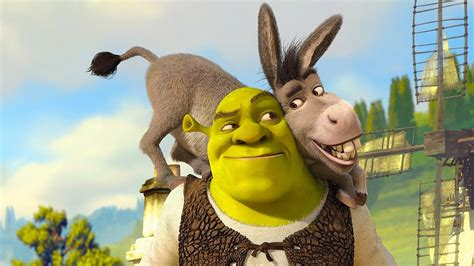

# new image file .shrek!

Imagine a completely open source image file. Shrek does exactly that! The good thing is that you can take this code and create your own files, but you must use our license.

